# Nebula

로컬 기반의 분류 노트앱입니다.

여기서 Nebula는 노트들의 순서있는 트리 구조를 의미합니다.

사용자는 임의로 Nebula를 만들거나 지울 수 있습니다.

## 기능 명세

### 텍스트 에디터 기능

1. 들여쓰기 & 내어쓰기

    [Tab]으로 들여쓰기할 수 있으며 [Shift] + [Tab]으로 내어쓰기할 수 있습니다.

    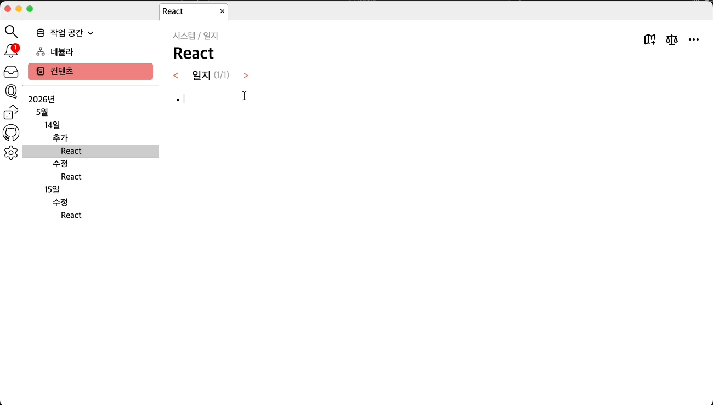

2. 라인 교체

    [Alt] + [↑/↓]로 라인을 교체할 수 있습니다.

    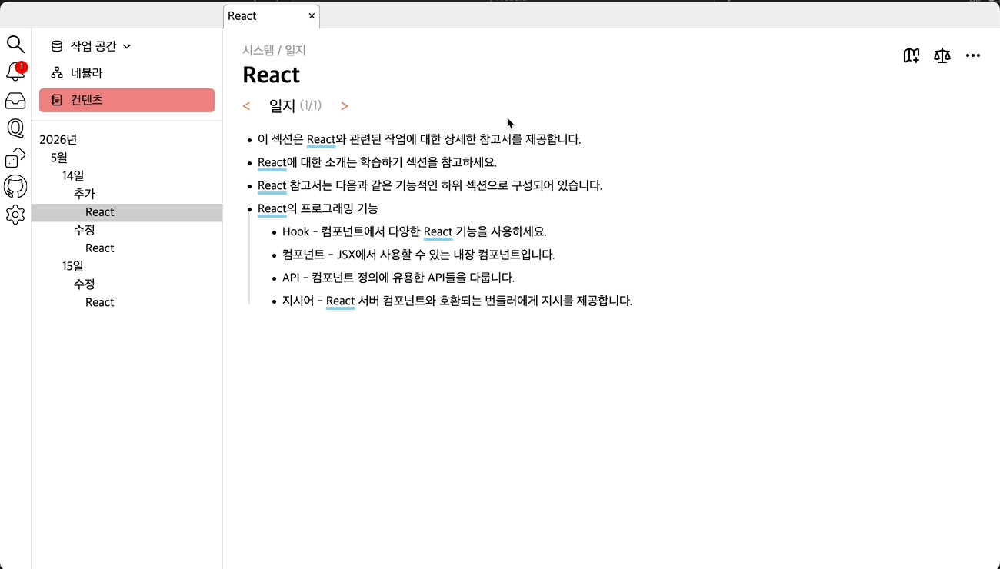

3. 페이지 참조

    [[페이지명]]으로 페이지끼리 참조를 형성할 수 있습니다.

    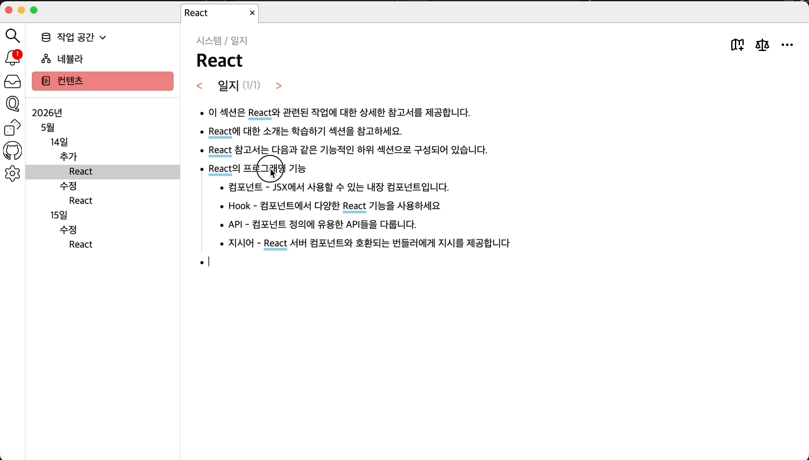

4. 파일 참조

    {{파일 경로}}로 파일에 대한 참조를 만들 수 있습니다.

    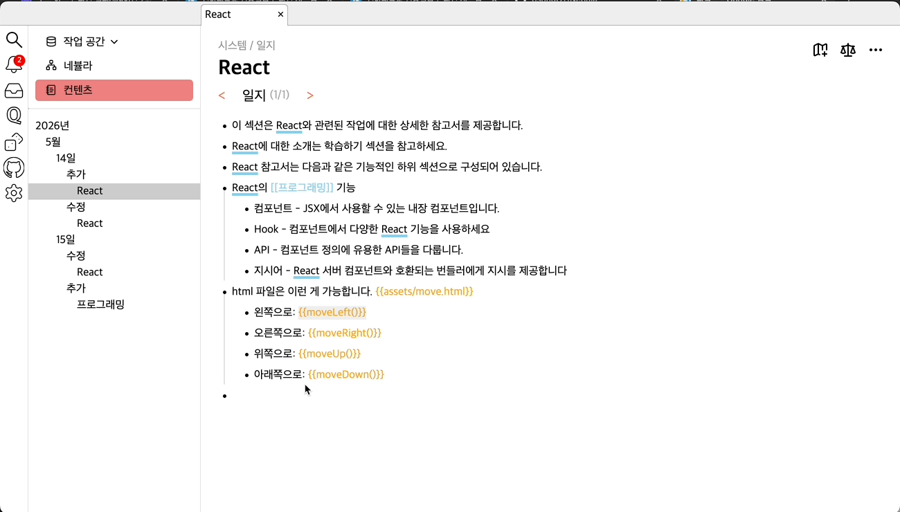

    *.html 파일의 경우 해당 파일에 내재된 함수를 실행시킬 수 있습니다.

    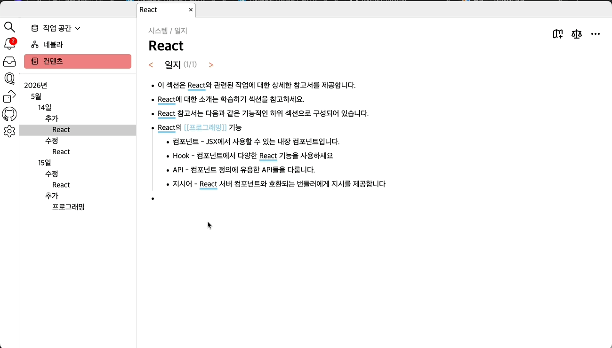

5. 기록

    참조 연결을 통해 하위 개념 페이지를 현재 Nebula에 소속시킬 수 있습니다.

    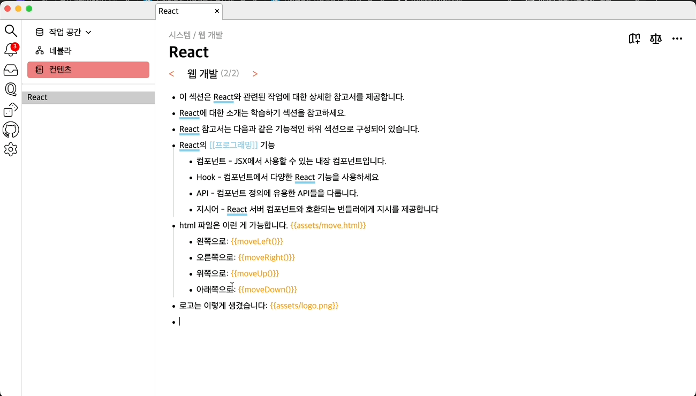

6. 언급에서 참조로 변경

    페이지 참조 문법으로 연결되지 않은 페이지는 하이라이팅되며 참조로 쉽게 전환이 가능합니다.

    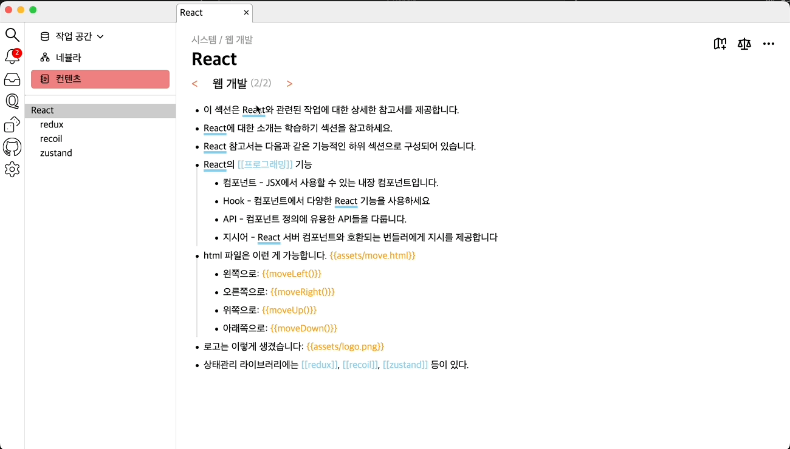

### 분류 기능

1. 부분 Nebula

    Nebula의 일부를 선택해 해당 부분을 구성원으로 하는 새 Nebula를 만들 수 있습니다.

    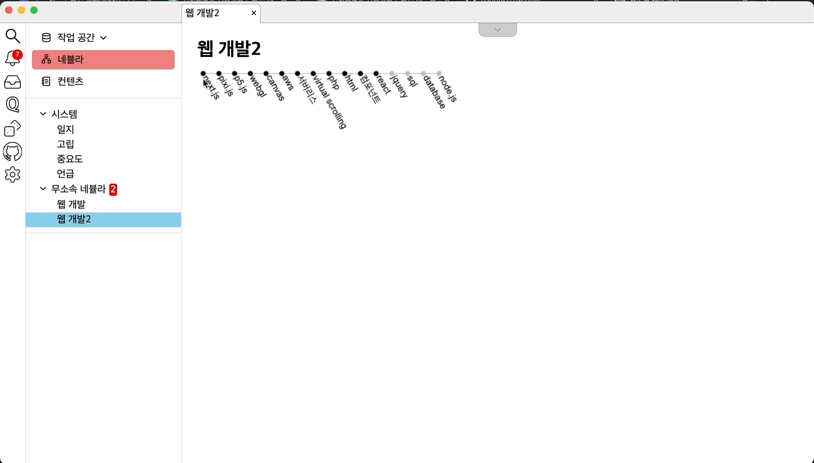

2. 네비게이션

    현재 페이지가 속한 다른 Nebula로 쉽게 넘어갈 수 있습니다.

    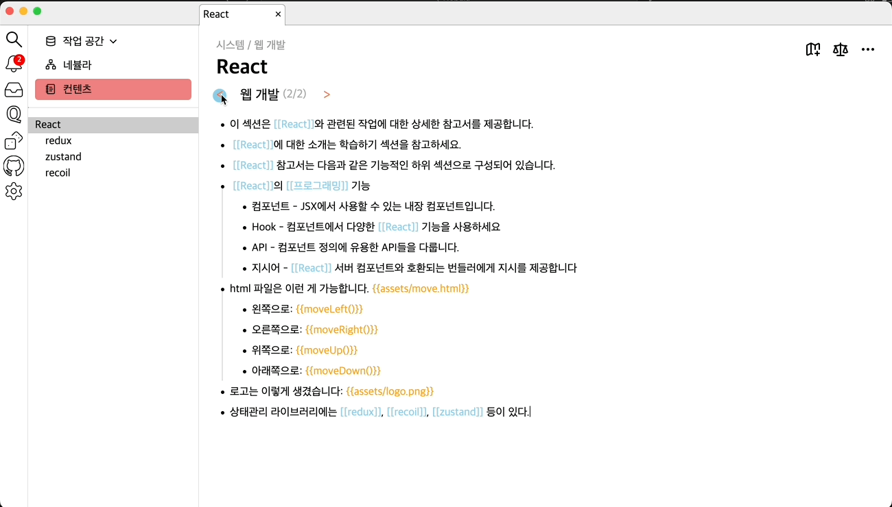

3. 특별한 Nebula들

    - 일지 : 페이지가 추가된 날짜와 수정된 날짜에 따른 자동 분류 Nebula입니다.

    - 고립 : 일지 Nebula를 제외한 다른 어떤 소속도 없는 페이지를 자동 수집하는 Nebula입니다.

    - 중요도 : 통계를 위한 Nebula이며, 기준에 따른 중요도를 기준으로 분류하는 Nebula입니다.

        - 소속 네뷸라 수 : 페이지가 소속된 네뷸라 중 특별한 Nebula들을 제외한 개수입니다.

        - 부모 수 : Nebula에서 다른 페이지의 하위 개념으로 쓰인 횟수입니다.

        - 자식 수 : Nebula에서 다른 페이지의 상위 개념으로 쓰인 횟수입니다.

        - 더스트 수 : 페이지를 구성하는 문장들의 개수입니다. n줄로 구성돼있다면 더스트 수는 n입니다.

    - 언급 : 다른 페이지의 이름이 등장했으나 참조가 되지 못한 페이지들을 모으는 Nebula입니다.

### Git 기능

1. 새로 추가된 라인 표시

이전 commit 이후에 파일에 새로운 라인이 추가되면 표시가 생깁니다.

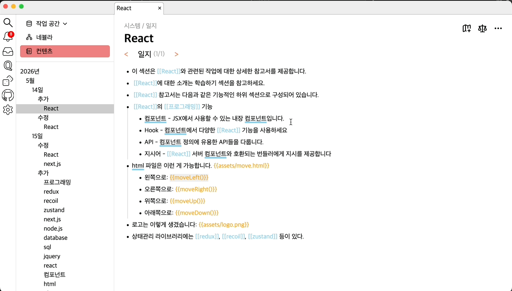

2. Commit

메시지와 함께 commit할 수 있습니다.

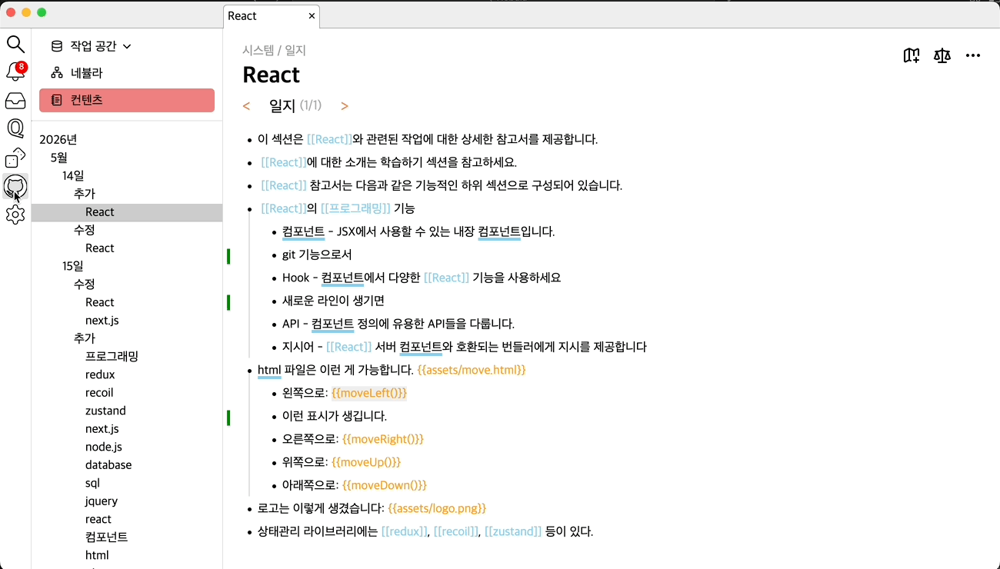

3. 변경 사항 보기

몇줄에서 변경 사항이 발생했는지 확인 가능합니다.

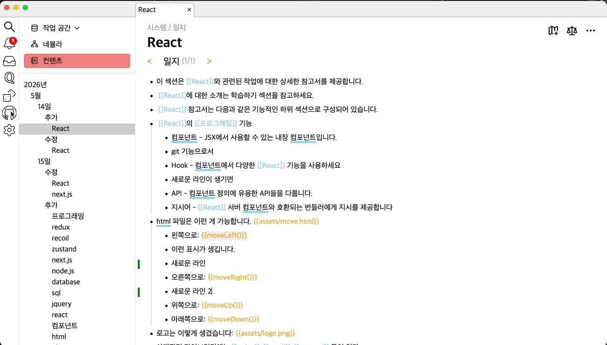

4. 히스토리 보기

커밋 히스토리를 볼 수 있습니다.

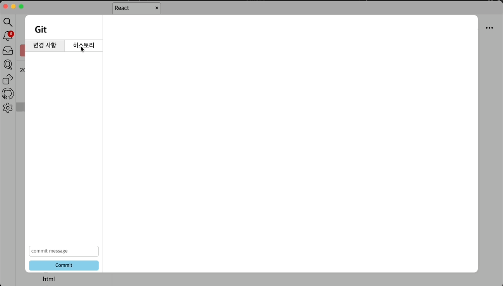

## 기술 스택

- Electron

- TypeScript

- Webpack